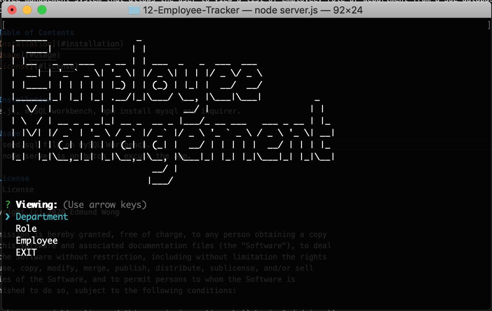

# Employee Tracker
Employee management system that allows the user to view a list of employee, role or department from a SQL database and take actions to either add, edit or delete a record from the database.

## Table of Contents
* [Installation](#installation)
* [Usage](#usage)
* [License](#license)

## Installation
Node.js, mySQL workbench, npm install mysql and inquirer.

## Usage
Run seed.sql file on mySQL Workbench.
Run node server.js on batch to excute the app.

## License
MIT License

Copyright (c) 2020 Edmund Wong

Permission is hereby granted, free of charge, to any person obtaining a copy
of this software and associated documentation files (the "Software"), to deal
in the Software without restriction, including without limitation the rights
to use, copy, modify, merge, publish, distribute, sublicense, and/or sell
copies of the Software, and to permit persons to whom the Software is
furnished to do so, subject to the following conditions:

The above copyright notice and this permission notice shall be included in all
copies or substantial portions of the Software.

THE SOFTWARE IS PROVIDED "AS IS", WITHOUT WARRANTY OF ANY KIND, EXPRESS OR
IMPLIED, INCLUDING BUT NOT LIMITED TO THE WARRANTIES OF MERCHANTABILITY,
FITNESS FOR A PARTICULAR PURPOSE AND NONINFRINGEMENT. IN NO EVENT SHALL THE
AUTHORS OR COPYRIGHT HOLDERS BE LIABLE FOR ANY CLAIM, DAMAGES OR OTHER
LIABILITY, WHETHER IN AN ACTION OF CONTRACT, TORT OR OTHERWISE, ARISING FROM,
OUT OF OR IN CONNECTION WITH THE SOFTWARE OR THE USE OR OTHER DEALINGS IN THE
SOFTWARE.

This project was created by Edmund Wong - [check porfolio](https://wesycool.github.io/portfolio/)